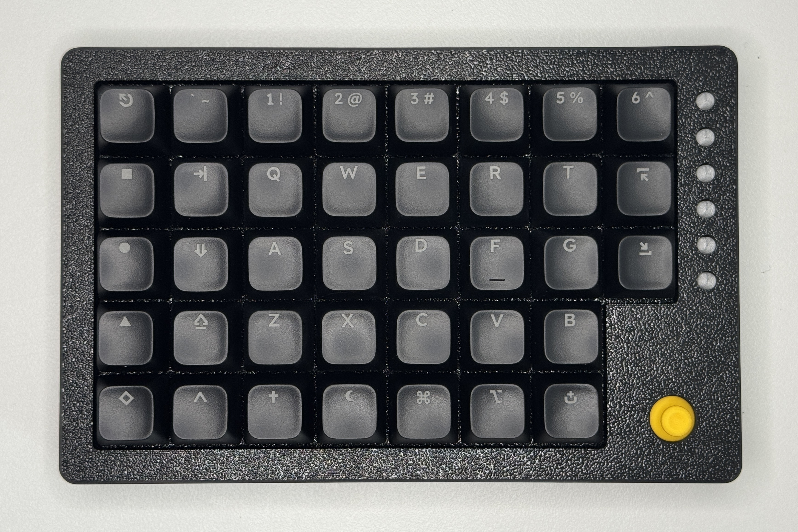
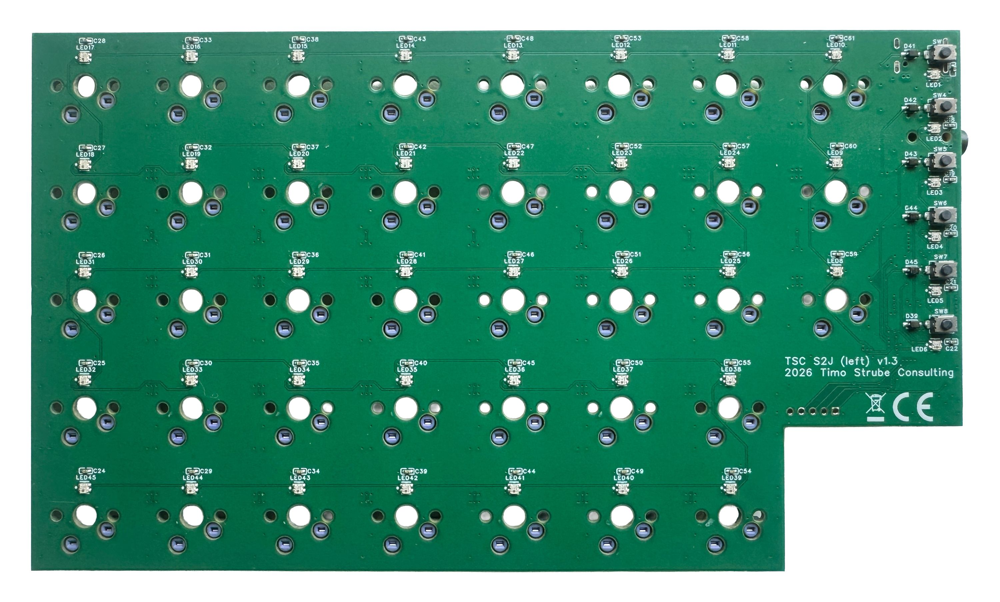
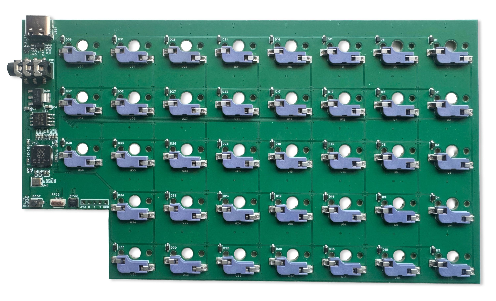
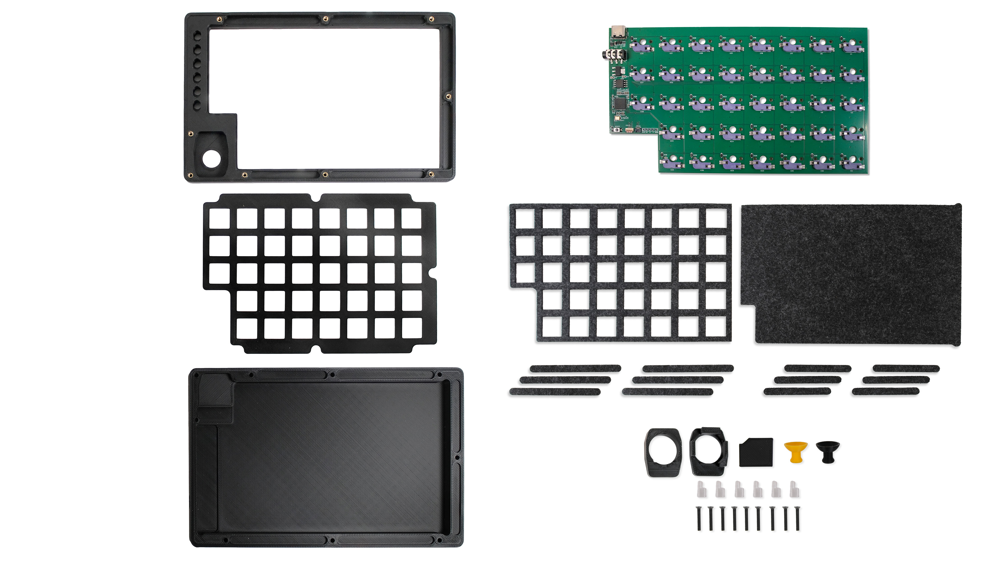
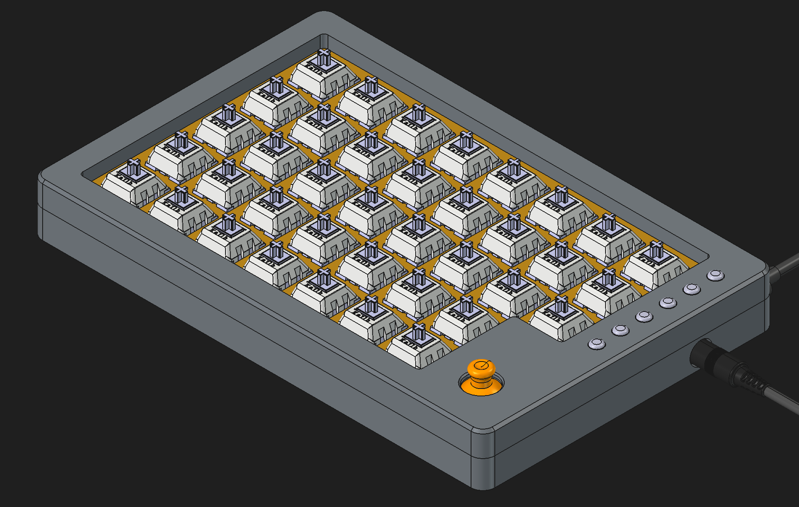
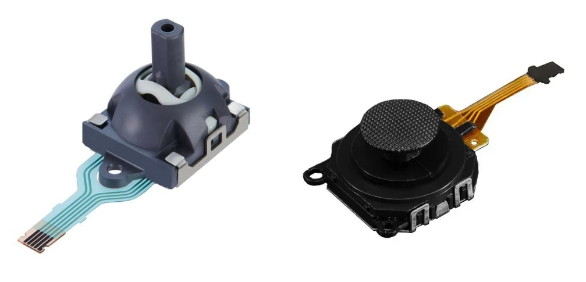

*Split keyboard*

---

*Left half detail view*

---

*Backlight off*

---

*PCB front*

---

*PCB back (old version with RP2040 instead of STM32F401)*

---

*All parts of one half of the keyboard*

---

*Keyboard stackup*

---

*3D Render*

*Joystick options (left: RKJX21224001, right: RKJXU1210006 (PSP3000))*
