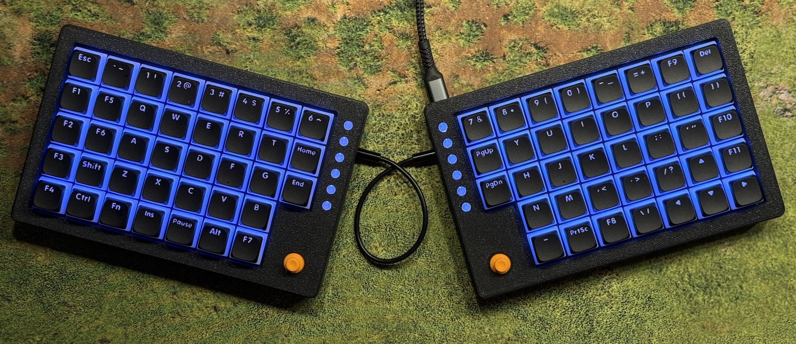
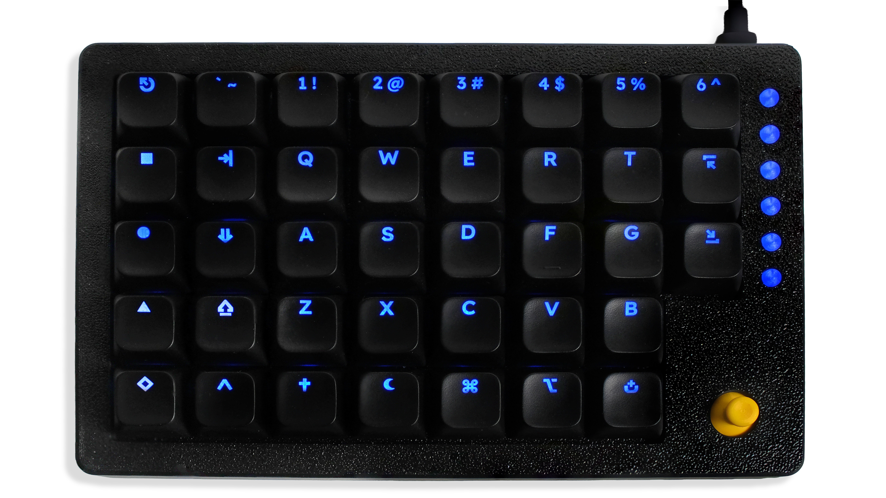
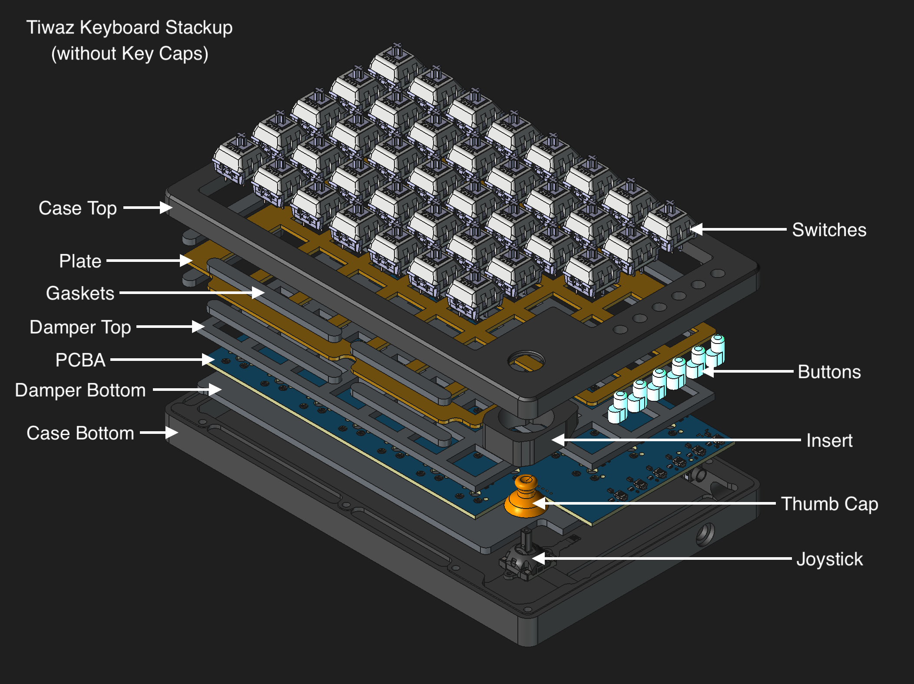
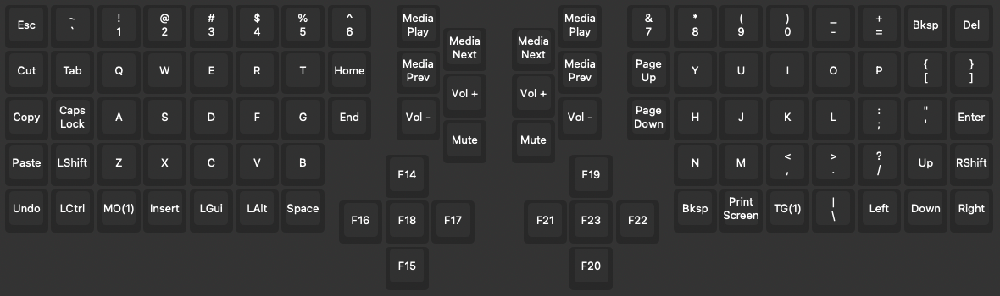
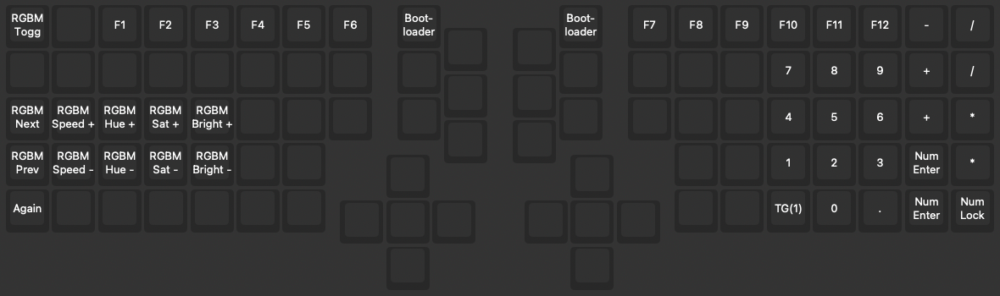
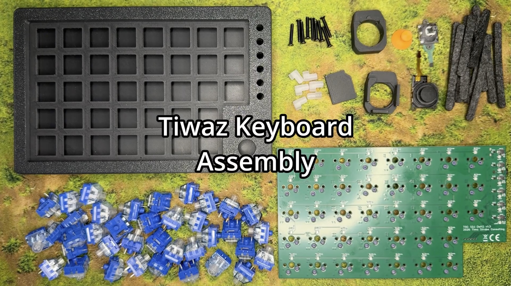

# Tiwaz

Tiwaz is a split keyboard with gasket mounted plate and hot-swappable switches. Each half works standalone as a one-handed controller or macro pad. This makes this one of the only gaming keyboards for left handed users. 

The defining feature are the joysticks. They can operate as regular analog gamepad sticks, digital buttons, or mouse input, and use ribbon cables to connect to the PCB.

There are multiple options including solder pads that allow access to the joysticks pins for custom applications.

QMK and VIAL support allow button remapping in the browser without manual reflashing.

[More Images](Images/README.md)

## Features

- Each half usable standalone as a one-handed controller or macro pad
- Two joystick options (Alps Alpine [RKJX21224001](https://tech.alpsalpine.com/e/products/detail/RKJX21224001/) / [PSP3000-style RKJXU1210006](https://tech.alpsalpine.com/e/products/detail/RKJXU1210006/))
- 6 separate media keys
- all switches and buttons are RGB backlit
- FN + lowest media key switch Joystick input mode (digital buttons (blue indicator light), analog gamepad (yellow), mouse (red))
  - digital buttons: 4 directions + center button, can be used as regular buttons or arrow keys, for example
  - analog gamepad: the joysticks are recognized as gamepad axes with a gamepad button
  - mouse: the joysticks control the mouse cursor, clicking by pressing the joystick down. To drag move before 500ms after pressing down, otherwise it will be a right click.
  - the indicator light is hardcoded. It is recommended to not change this key mapping
- Gasket mounted plate for a dampened typing feel
- Dapening material between Plate and PCB, as well as PCB and case
- [QMK firmware](https://github.com/tstrube/qmk_firmware/tree/tiwaz/keyboards/tiwaz) *([pull-request pending](https://github.com/qmk/qmk_firmware/pull/26438))* - [QMK website](https://www.qmk.fm/)
- [VIAL firmware](https://github.com/tstrube/vial-qmk/tree/tiwaz/keyboards/tiwaz) *(pull-request after QMK merged)* - [VIAL website](https://get.vial.today/)

## PCB details

- STM32F401RET6 MCU
- 38 hot-swap connectors for MX type switches
- 6 auxiliary buttons (intended as media keys, but remappable, of course)
- WS2812 RGB LED for each switch and button
- AUX connector for power and data transmission to the other half (only one half should be connected to the PC at any time)
- Ideal diode to protect against accidentally plugging in both halves while they are connect to each other
- Self-resetting fuse to to protect against high power draw of the LEDs (though limited in firmware)
- ESD protection on the USB and AUX connectors
- Solder points for joystick pins (ADC (2x), GPIO, GND, 3V3) 

## Bill of Materials

- PCB available on [Crowd Supply](https://www.crowdsupply.com/ts-consulting/tiwaz)
- Case available on [Printables](https://www.printables.com/model/1715647-tiwaz-split-gaming-keyboard-gasket-mounted)
- Ergo Keycaps (not affiliated, just recommendations. There are very few backlit 1u sets available)
  - FK custom: [Left half](https://custom.fkcaps.com/custom/ZMRFDB) - [Right half](https://custom.fkcaps.com/custom/MJQDKY) - [Both halves](https://custom.fkcaps.com/custom/L3QJ2N)
  - [LPF Glow Legended Low Profile MX Keycaps](https://splitkb.com/products/lpf-glow-legended-mx-keycaps)
  - [THT (Tai-Hao Thins) Low Profile Keycaps - 98 PCS](https://shop.tai-hao.com/products/98black)
  - [THT (Tai-Hao Thins) Low Profile Keycaps - 65 Keys](https://shop.tai-hao.com/products/black-low-profile-keycaps)
  - [THT (Tai-Hao Thins) Low Profile Keycaps - Blanks](https://shop.tai-hao.com/products/taihao-black-low-profile-keycap-1u-dot-pbt-backlit)

## Assembly video

[Watch the assembly video on YouTube](https://www.youtube.com/watch?v=tHYdIYXT8AQ)
